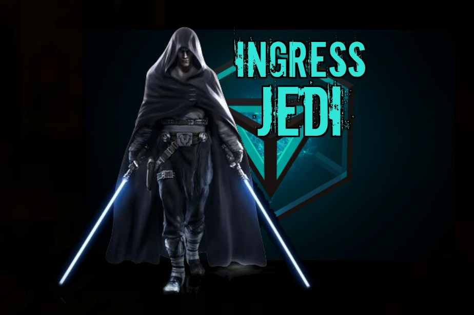
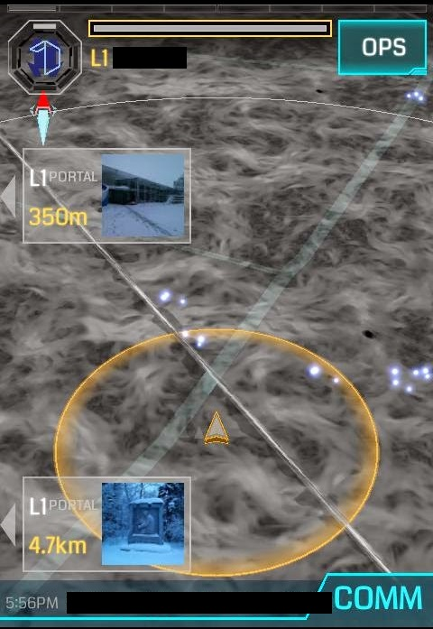

# Ingress 灰武士 [1]

**作者**：DannoReg

XF-CC [2]

**原文链接**：[FevGames](https://fevgames.net/gray-ingress-jedi/)

**翻译**：Agent ID: GangZhao Telegram: ZhaoGang

## 爆炸

原力出现了扰动。你可能已经感觉到了。如果没有，那你是幸运的 -- 因为不可避免的事情已经发生。Niantic 收到了大量的违反 TOS [3] 玩家的证据。特工们（从言语上）攻击对方阵营，甚至己方阵营的（违规）玩家。数以千计的特工发现他们被调查了。这很不幸。我们刚刚见证了 Ingress 里光明面和黑暗面特工的最大一次冲突，作为大多数的中间派，我们小心的注意着自己的言行。

如果你想在这次核爆式的事件里全身而退，或者你想知道这次事件如何影响了普通的特工，那么这篇文章是写给你的。

无论你和谁谈论这件事，话题总会无可避免的变成对越来越琐碎的事件真相的争论。几乎所有人会发现他们在这些细节详细的事件里处于两难之地，甚至朋友之间也是这样。这就是为什么如果你想在这次事件里找到自己位置，重要的是要专注自己的内心。不要专注于对讨论中的琐碎细节的看法，而要注意你在整个事件里站在哪一边。

## 你站在哪一边？

**光明面** 的特工相信需要严格遵守 TOS。他们拒绝所有试图绕过 TOS 的行为；他们看待事物非黑即白，没有中间状态。他们会找到每一个他们认为违反规则的玩家，用他们能找到的任何证据去让对方被官方封号。

**黑暗面** 的特工愿意用一切他们能找到的工具让自己在游戏里更强大。他们不在乎 TOS，他们觉得为了保持在游戏里处于优势地位，使用插件和第三方应用程序是必须的。这是灾难的开始。一些黑暗面特工没有为他们手中工具的力量做好准备，他们为了达到个人目标滥用工具。他们在使用这些工具时真的可能会伤害到其他人。作为一个黑暗面的特工，他们最好持续的审视自己，才不会堕入不可挽回的虚空。那些没能把握住自己的人会发现他们被别人拉入黑名单，被封号，甚至更严重。

## 中间派

所以所有光明面的特工都是圣人吗？不见得。有许多特工了解使用 IITC [4] 这类工具的好处，即使从技术上来说 IITC 是一个第三方程序（而不仅是一个 intel 地图的插件）。他们用不那么正式的标准判断一个应用程序是否给游戏提供了不公平的优势。即使他们自己不用这类程序或数据库，他们一般不去谴责为了好的动机去用的人，以及使用阵营双方都能使用的应用程序的人。

另一方面，是不是所有黑暗面的特工都是作弊者？我认为不是。有许多特工坚持把数据抓取和第三方应用程序用在对 Ingress 产生正面影响的地方。许多特工只会使用那些不会产生什么（严重）影响和后果的插件。他们知道从字面意义上来说他们违反了 TOS，但他们认为自己坚持了游戏的 **精神**。那些特工真的是把他们的超能力用在了好的方面。在全面考虑之后，他们不会因为抓取了数据或使用了第三方程序而后悔或道歉。在被问到时，他们认为自己的决定是完全合理的。

## 说说灰武士

Ingress 五周年之际，对数据抓取/位置欺骗的态度几乎达到了一个沸点。为了应对游戏规则的改变和游戏里更多的挑战，我们都在探索新的方法，一些可预测的结果将会出现。

光明面的特工会继续为铲除作弊者努力。他们会有鼓舞人心的胜利，一些黑暗面的特工被封号，但是奖励比不上对应的付出。随着（双方矛盾）持续和强烈的激化，黑暗面的特工总是可以创建账号，重新开始，因此光明面的特工花费的时间和精力会被证明是无用的。硬核的光明面特工会悲哀的发现自己处在永无止境的循环里，不得不接受他们不停增长的愤怒是 Ingress 里的一个现实。同时，在有意无意的犯下第一个错误时，他们极有可能被标记成是一个伪君子。他们困在自己制作的贞操带里无法逃脱。

黑暗面的特工会继续获取、导出和分析 Niantic 的数据，继续以他们最坏的目的去滥用数据。工具会越来越强大。许多最坏的特工会被封号，然后怀着（报复的）动机回来。这些特工注定陷于（作弊 - 封号 - 作弊）的因果循环里，所以他们也是悲惨的。和光明面的特工一样，黑暗面的特工最终会发现他们困在自己制作的笼子里。

面对这种现实，灰武士有一个选择。几乎所有的灰武士都是从整体上来看待 Ingress，他们会选择同时符合他们的道德和阵营标准的道路。他们会使用 IITC 这种双方阵营都可以接触到的应用程序。他们会使用抓取的数据，如果他们知道这些数据可以帮助抓住黑暗面的特工。他们会更多的思考自己的意图是否真诚，而不是只关注字面意义上的 TOS。他们会继续拒绝把这种有力的资源用在可憎的目的。只要继续走在这条道路上，他们就会更喜欢这个游戏，他们会从意想不到的地方找到朋友，这是最核心的，**这就是 Ingress**。人，首先是人，永远如此。

在这次的整个事件中隐藏着一个道理，那就是：这个游戏里没什么是非黑即白的。需要各方平衡才能让游戏运转起来。一方不能离开另一方单独存在。这句话值得一次次的强调。

从此之后，你的道路只由你选择。即便如此，假设我的推测是正确的，显然灰武士会最终胜出。他们也许和制作大型 field 无关，也不是历史上进入地区排行榜时间最长的人，但最终，和选择走在刀锋上的那些人相比，他们会获得更多的乐趣，找到更多的朋友。

**祝你好运，愿 XM 与你同在。**

**Ingress 武士**

[1] Jedi 也许应该翻译成绝地武士，这里简称为武士

[2] Ingress X-Faction Communication Cooperative（Ingress 跨阵营通信协调）[Google+](https://plus.google.com/communities/100247825120361901555) [XF-CC China](https://plus.google.com/communities/107216461300986029749)

[3] Terms of Service（服务协议）[Ingress Terms of Service](https://www.ingress.com/terms)

[4] Ingress Intel Total Conversion [IITC](https://iitc.me/)

注：正文里括号部分是译者加的，希望有助于理解原文。翻译可能有理解错误，欢迎在 [GitHub](https://github.com/zhao-gang/translation/issues) 上报错。

译后记：希望 Ingress 玩家们都能快乐的享受 Ingress，同时希望蓝绿之间不仅有对抗，也有更多的交流和合作。
